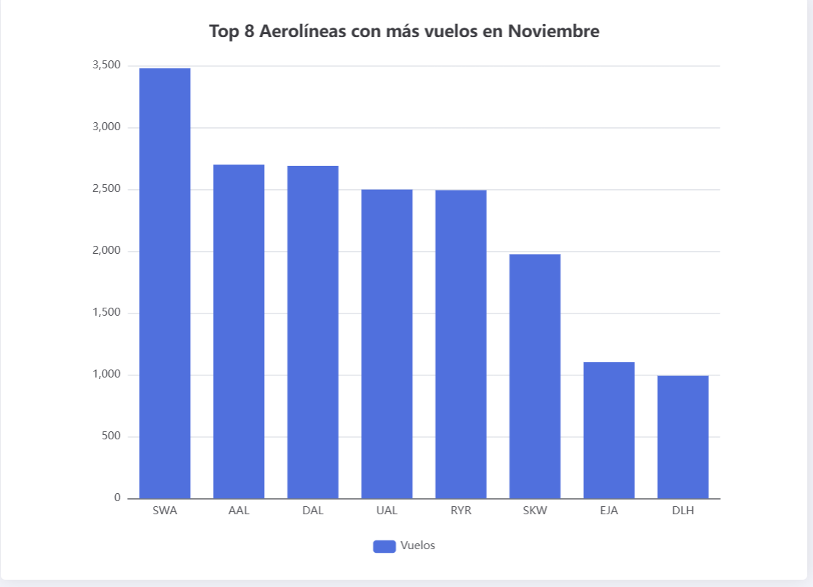

# Frontend MCP Server 🛫

[](https://github.com/angular/angular-cli)
[](LICENSE)

## 📝 Description

An intelligent flight information chatbot powered by AI. This project integrates:

- **Frontend**: Angular-based interface for user interactions
- **Database**: MSSQL local database for flight data storage
- **AI Integration**: LLM hosted in n8n for natural language processing
- **MCP Tools**: Local Model Context Protocol server providing:
  - Flight information retrieval
  - Airline statistics visualization
  - Interactive data graphs generation

## 🚀 Quick Start

### Prerequisites

- Node.js
- npm
- Angular CLI

### Installation & Running

1. Navigate to the project directory:
```bash
cd frontend-mcp-server
```
2. Install dependencies
```bash
npm install
```
3. Start the server:
```bash
npm run start:dev
```
4. Open your browser and visit `http://localhost:4200`

## 🛠️ Technologies

- Angular 20.3.4
- TypeScript
- MSSQL
- n8n
- Model Context Protocol

## 📦 Features

- Real-time flight information queries
- Interactive data visualization
- Natural language processing
- Airline statistics generation

## 📊 Data Visualization Examples

Here are some examples of the data visualizations generated by our chatbot:

### Airlines Bar Chart


### Airlines Pie Chart


## 🤝 Contributing

Contributions, issues, and feature requests are welcome!

## 📝 License

This project is [MIT](LICENSE) licensed.